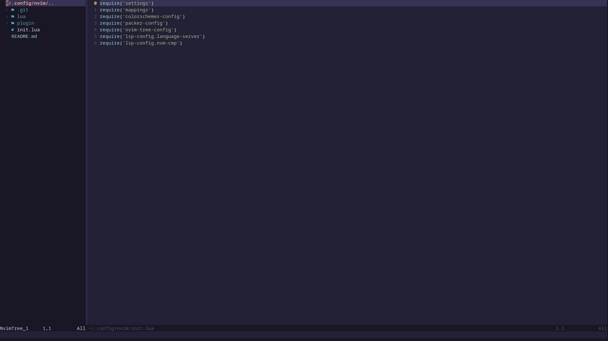

# Neovim config lua

## Linguagens com LSP
- Golang
- Python

## Mapping
| Shortcute | Links |
| ------ | ------ |
| mapleader | space |
| alt+ < or > | move tab |
| leader + t | NvimTreeToggle |
| leader + ff | Telescope |
| leader + fg | Telescope Live |
| leader + tf | Terminal float  |
| leader + th | Terminal horizontal |
| leader + tv | Terminal vertical |

## Requisitos

- [Packer](https://github.com/wbthomason/packer.nvim) Comando para atualizar `:PackerSync`
- `sudo pacman -S gopls`
- `npm i -g pyright`

| Plugin | Links |
| ------ | ------ |
| Nvim-tree | https://github.com/kyazdani42/nvim-tree.lua |
| Nvim-web-devicons| https://github.com/kyazdani42/nvim-web-devicons |
| NightFox Theme | https://github.com/EdenEast/nightfox.nvim |
| LSP Manager | https://github.com/neovim/nvim-lspconfig |
| LSP Completion | https://github.com/hrsh7th/nvim-cmp |
| Nvim notify | https://github.com/rcarriga/nvim-notify |
| Barbar | https://github.com/romgrk/barbar.nvim |
| Telescope | https://github.com/nvim-telescope/telescope.nvim |
| Treesitter | https://github.com/nvim-treesitter/nvim-treesitter |

## Próximas features

- [ ] terminal - https://github.com/akinsho/toggleterm.nvim

- [x] Telescope - https://github.com/nvim-telescope/telescope.nvim

- [ ] AutoPairs - https://github.com/windwp/nvim-autopairs

- [ ] Formatting & Linting - https://github.com/jose-elias-alvarez/null-ls.nvim

